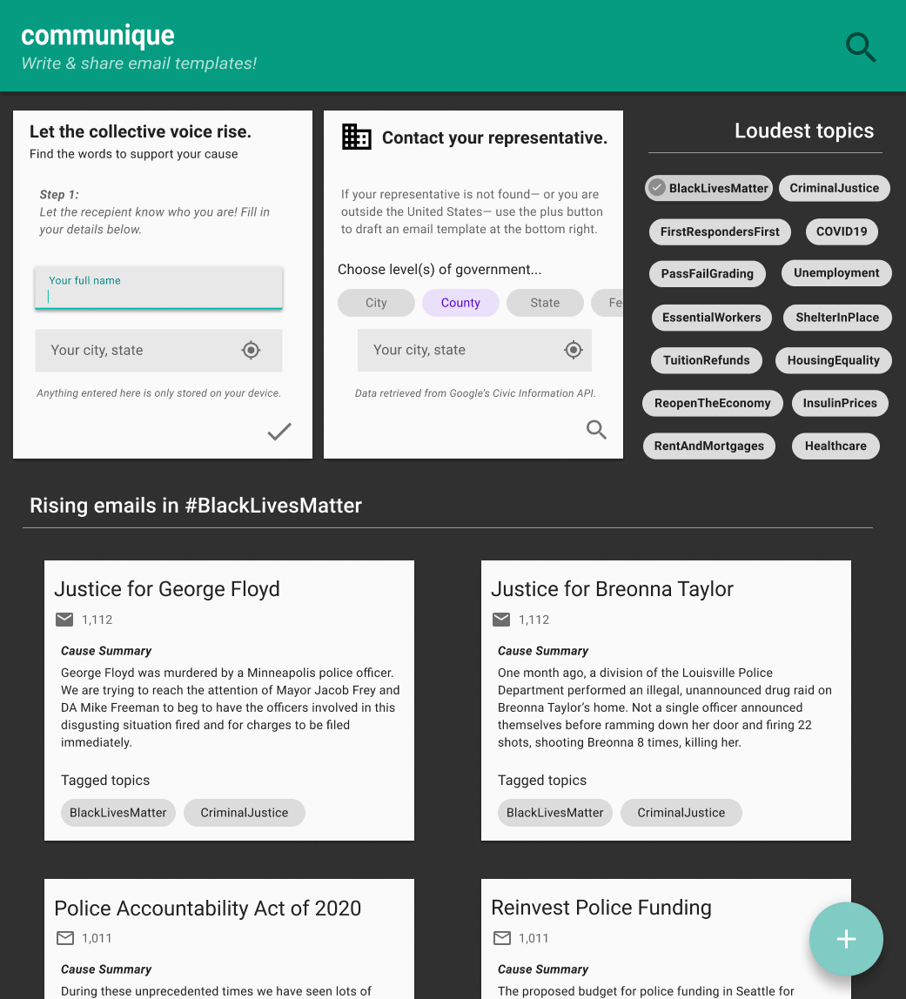

# **communique**

**[work-in-progress]** 

A web platform that enables sharing, browsing & generation of email message templates via `mailto` links.

[Figma mock](https://www.figma.com/file/RcjBRpAkK7W0aDx0J9XVGQ/communique?node-id=26495%3A29379)




## Stack

- [Flutter](https://flutter.dev/)
- [Firebase](https://firebase.google.com/)

## Running locally for development

### _Dependencies:_

- [Flutter SDK](https://flutter.dev/docs/get-started/install)

### _Run these commands to enable Flutter web support:_

```
 flutter channel beta
 flutter upgrade
 flutter config --enable-web
```
